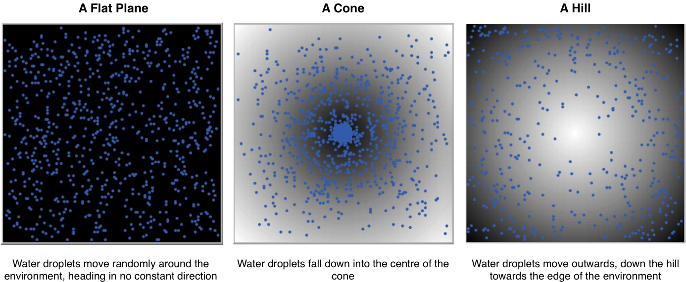

#Verification: Rainfall Example

## Introduction

By subjecting agents to a simplified environmental conditions, it is possible to clearly identify the behaviours that do not align with expectations. 

An example of this form of verification can be found in the Rainfall model. While the model is designed to operate using a GIS raster input, which defines the behaviour of raindrops in relation to their flow and accumulation within the model environment. 

We also allow abstract spaces. These include **flat** **plane**, a **cone** **shape**, and a **simple hill** as shown in the figure below

These "*simplified*" environments allow the movement of agents to be easily seen, and performance judged accordingly. 

Experiment with the Rainfall Model. If you change the landscape (**MapType**) to Flat, Cone, and Hill, does the water behave as expected?