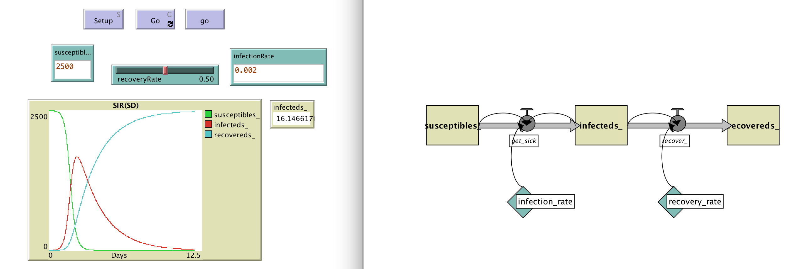
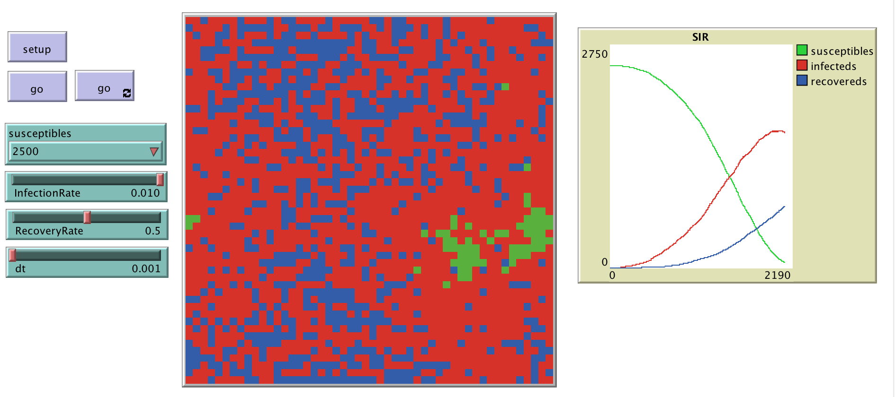
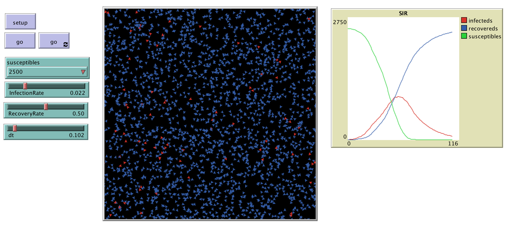
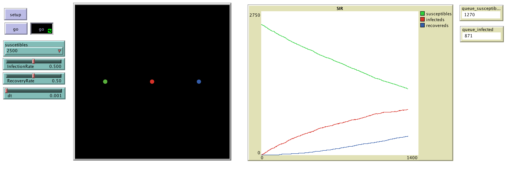

# SIR Models

This folder includes the accompanying resources for the chatper. For full book details, see: [http://www.abmgis.org/](http://www.abmgis.org/).

To compare differnet modeling approaches to the same issue, in this folder you will find 4 models:

* Cellular Automata ([SIR_CA.nlogo](SIR_CA.nlogo))
* Discreet Event Simulation (SIR_DES.nlogo)
* System Dynamics Model (SIR_SD.nlogo)
* Agent-based Model (SIR_ABM.nlogo)

Each explores the spread of a disease using a a Susceptible-Infected-Recovered (SIR) epidemic model.

These models show that while the same general patterns emerge (i.e. disease spread), the reasons for this are very different.

Below is the Graphical User Inteface (GUI) for the System Dynamics Model (see: SIR_SD.nlogo).

Below is the GUI for the Cellular Automata SIR Model (see: SIR_CA.nlogo).

Below is the GUI for the Agent-based SIR Model (see: SIR_ABM.nlogo).

Below is the GUI for the Discreet Event Simulation SIR Model (see: SIR_DES.nlogo)

## References & Links
* **Shiflet, A. B., & Shiflet, G. W. (2014).** Introduction to Computational Science: Modeling and Simulation for the Sciences. Princeton University Press, Princeton, NJ.
	* The original SD SIR model can be found on the accompanying website: <https://ics.wofford-ecs.org/dynamics/NetLogo> 
